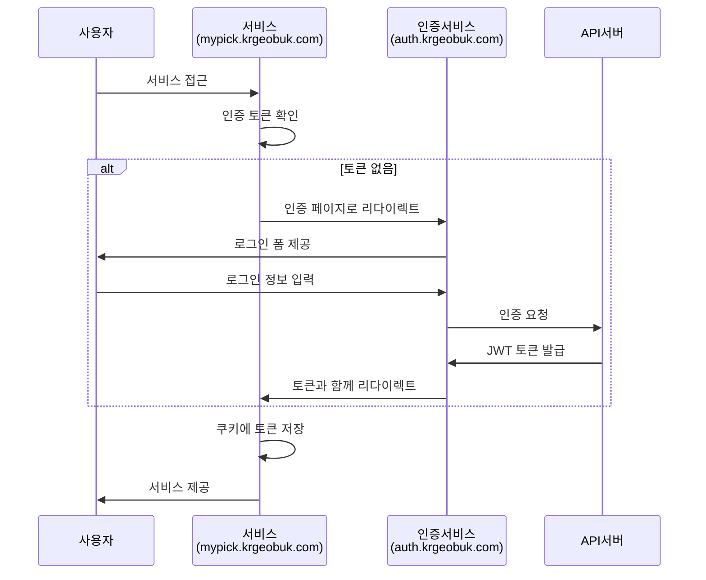

# krgeobuk 도메인 아키텍처 계획서

## 📋 개요

krgeobuk 생태계의 서브도메인 구조를 통일하여 확장성, 보안성, 사용자 경험을 최적화하는 도메인 아키텍처 계획입니다. JWT 기반 SSO와 서브도메인을 활용한 통합 인증 시스템을 구축합니다.

### 목표
- **일관성**: 통일된 네이밍 컨벤션으로 직관적인 서비스 구조
- **확장성**: 새로운 서비스 추가 시 일관된 패턴 적용
- **보안성**: 도메인 분리를 통한 보안 경계 강화
- **사용자 경험**: 단일 로그인으로 모든 서비스 접근

## 🌐 도메인 아키텍처 구조

### 최종 권장 도메인 구조

```
krgeobuk.com
├── auth.krgeobuk.com              # 통합 인증 서비스
├── portal.krgeobuk.com            # 통합 포털 (사용자)
├── portal-admin.krgeobuk.com      # 통합 포털 (관리자)
├── mypick.krgeobuk.com            # my-pick 서비스 (사용자)
├── mypick-admin.krgeobuk.com      # my-pick 서비스 (관리자)
├── api.krgeobuk.com               # API 게이트웨이
├── docs.krgeobuk.com              # API 문서
├── developers.krgeobuk.com        # 개발자 포털
├── help.krgeobuk.com              # 고객 지원
├── status.krgeobuk.com            # 서비스 상태
└── blog.krgeobuk.com              # 기술 블로그
```

### 네이밍 컨벤션

#### 기본 규칙
- **사용자 서비스**: `{service-name}.krgeobuk.com`
- **관리자 서비스**: `{service-name}-admin.krgeobuk.com`
- **지원 서비스**: `{purpose}.krgeobuk.com`

#### 예시 패턴
```typescript
const NAMING_CONVENTION = {
  // 서비스 패턴
  userService: '{service}.krgeobuk.com',        // 사용자 대면 서비스
  adminService: '{service}-admin.krgeobuk.com', // 관리자 서비스
  
  // 특수 목적 서비스
  auth: 'auth.krgeobuk.com',                    // 인증 서비스
  api: 'api.krgeobuk.com',                      # API 게이트웨이
  docs: 'docs.krgeobuk.com',                    # 문서 서비스
  
  // 지원 서비스
  support: 'help.krgeobuk.com',                 # 고객 지원
  monitoring: 'status.krgeobuk.com',            # 상태 모니터링
  content: 'blog.krgeobuk.com',                 # 콘텐츠
};
```

## 🏗️ 서비스별 도메인 매핑

### 현재 서비스

#### 인증 서비스
- **도메인**: `auth.krgeobuk.com`
- **목적**: 통합 SSO 인증, 로그인/회원가입
- **기술**: Next.js 15, JWT, OAuth 2.0
- **특징**: 모든 서비스의 인증 허브

#### 포털 서비스
- **사용자 포털**: `portal.krgeobuk.com`
  - 목적: 통합 서비스 관리, 사용자 대시보드
  - 대상: 일반 사용자, 서비스 이용자
  
- **관리자 포털**: `portal-admin.krgeobuk.com`  
  - 목적: 시스템 관리, 사용자/역할/권한 관리
  - 대상: 시스템 관리자, 운영진

#### my-pick 서비스
- **사용자 서비스**: `mypick.krgeobuk.com`
  - 목적: 크리에이터 콘텐츠 탐색, 개인화 서비스
  - 대상: 일반 사용자, 크리에이터 팬
  
- **관리자 서비스**: `mypick-admin.krgeobuk.com`
  - 목적: 크리에이터 관리, 콘텐츠 모니터링
  - 대상: 서비스 운영진, 콘텐츠 관리자

### 지원 서비스

#### API 및 개발자 서비스
```
api.krgeobuk.com          # REST API 게이트웨이
docs.krgeobuk.com         # API 문서 (Swagger, OpenAPI)
developers.krgeobuk.com   # 개발자 포털, SDK, 가이드
```

#### 고객 지원 서비스
```
help.krgeobuk.com         # 고객 지원, FAQ, 문의
status.krgeobuk.com       # 서비스 상태, 장애 공지
blog.krgeobuk.com         # 기술 블로그, 업데이트 소식
```

### 향후 확장 서비스 예시

#### 전자상거래 서비스
```
commerce.krgeobuk.com         # 전자상거래 사용자
commerce-admin.krgeobuk.com   # 전자상거래 관리자
```

#### 교육 서비스
```
edu.krgeobuk.com              # 온라인 교육 사용자
edu-admin.krgeobuk.com        # 교육 관리자
```

#### IoT 서비스
```
iot.krgeobuk.com              # IoT 디바이스 관리
iot-admin.krgeobuk.com        # IoT 관리자 콘솔
```

## 🔐 JWT SSO 아키텍처

### SSO 플로우 설계



### 크로스 도메인 토큰 공유

#### 쿠키 설정 전략
```typescript
// JWT 토큰 쿠키 설정
const SSO_COOKIE_CONFIG = {
  name: 'krgeobuk_auth_token',
  domain: '.krgeobuk.com',         // 모든 서브도메인에서 공유
  secure: true,                    // HTTPS 전용
  httpOnly: true,                  // XSS 방지
  sameSite: 'strict',              // CSRF 방지
  maxAge: 7 * 24 * 60 * 60,       // 7일
  path: '/',                       // 모든 경로에서 접근
};

// Refresh Token 설정 (보안 강화)
const REFRESH_COOKIE_CONFIG = {
  name: 'krgeobuk_refresh_token',
  domain: '.krgeobuk.com',
  secure: true,
  httpOnly: true,
  sameSite: 'strict',
  maxAge: 30 * 24 * 60 * 60,      // 30일
  path: '/auth/refresh',           // 제한된 경로
};
```

#### 토큰 검증 플로우
```typescript
// 각 서비스에서의 토큰 검증
const TokenValidator = {
  async validateToken(token: string): Promise<boolean> {
    try {
      // JWT 서명 검증
      const payload = jwt.verify(token, process.env.JWT_PUBLIC_KEY);
      
      // 토큰 만료 시간 확인
      if (payload.exp < Date.now() / 1000) {
        return false;
      }
      
      // 사용자 권한 확인 (서비스별)
      const hasPermission = await checkServicePermission(
        payload.userId, 
        getCurrentService()
      );
      
      return hasPermission;
    } catch (error) {
      return false;
    }
  },
  
  async refreshTokenIfNeeded(token: string): Promise<string | null> {
    const payload = jwt.decode(token);
    const timeUntilExpiry = payload.exp - Date.now() / 1000;
    
    // 30분 미만 남으면 자동 갱신
    if (timeUntilExpiry < 1800) {
      return await authService.refreshToken();
    }
    
    return token;
  }
};
```

## 🔧 기술적 구현 가이드

### DNS 설정

#### A 레코드 설정
```bash
# 메인 도메인
krgeobuk.com                    A    203.0.113.1

# 인증 서비스
auth.krgeobuk.com              A    203.0.113.10

# 포털 서비스
portal.krgeobuk.com            A    203.0.113.20
portal-admin.krgeobuk.com      A    203.0.113.21

# my-pick 서비스
mypick.krgeobuk.com            A    203.0.113.30
mypick-admin.krgeobuk.com      A    203.0.113.31

# API 및 지원 서비스
api.krgeobuk.com               A    203.0.113.40
docs.krgeobuk.com              A    203.0.113.41
developers.krgeobuk.com        A    203.0.113.42
help.krgeobuk.com              A    203.0.113.43
status.krgeobuk.com            A    203.0.113.44
blog.krgeobuk.com              A    203.0.113.45
```

#### CNAME 레코드 (CDN 활용 시)
```bash
# CDN 활용 예시
cdn.krgeobuk.com               CNAME    d123456789.cloudfront.net
assets.krgeobuk.com            CNAME    d987654321.cloudfront.net
```

### SSL 인증서 전략

#### 와일드카드 인증서 (권장)
```bash
# Let's Encrypt 와일드카드 인증서
certbot certonly \
  --manual \
  --preferred-challenges=dns \
  --email admin@krgeobuk.com \
  --server https://acme-v02.api.letsencrypt.org/directory \
  --agree-tos \
  -d "*.krgeobuk.com" \
  -d "krgeobuk.com"
```

#### Nginx SSL 설정 예시
```nginx
# /etc/nginx/sites-available/krgeobuk-ssl
server {
    listen 443 ssl http2;
    server_name *.krgeobuk.com krgeobuk.com;
    
    ssl_certificate /etc/letsencrypt/live/krgeobuk.com/fullchain.pem;
    ssl_certificate_key /etc/letsencrypt/live/krgeobuk.com/privkey.pem;
    
    # SSL 최적화 설정
    ssl_protocols TLSv1.2 TLSv1.3;
    ssl_ciphers ECDHE-RSA-AES256-GCM-SHA512:DHE-RSA-AES256-GCM-SHA512;
    ssl_prefer_server_ciphers off;
    
    # HSTS 헤더
    add_header Strict-Transport-Security "max-age=63072000" always;
    
    # 서브도메인별 라우팅
    location / {
        if ($host ~ ^auth\.krgeobuk\.com$) {
            proxy_pass http://auth-service:3000;
        }
        
        if ($host ~ ^portal\.krgeobuk\.com$) {
            proxy_pass http://portal-service:3000;
        }
        
        if ($host ~ ^portal-admin\.krgeobuk\.com$) {
            proxy_pass http://portal-admin-service:3000;
        }
        
        # 기타 서비스들...
    }
}
```

### Docker 컨테이너 구성

#### Docker Compose 설정
```yaml
# docker-compose.yml
version: '3.8'

services:
  # 인증 서비스
  auth-service:
    build: ./auth-client
    container_name: krgeobuk-auth
    ports:
      - "3000:3000"
    environment:
      - NEXT_PUBLIC_DOMAIN=auth.krgeobuk.com
      - JWT_SECRET=${JWT_SECRET}
    networks:
      - krgeobuk-network

  # 포털 서비스 (사용자)
  portal-service:
    build: ./portal-client
    container_name: krgeobuk-portal
    ports:
      - "3001:3000"
    environment:
      - NEXT_PUBLIC_DOMAIN=portal.krgeobuk.com
      - NEXT_PUBLIC_AUTH_URL=https://auth.krgeobuk.com
    networks:
      - krgeobuk-network

  # 포털 서비스 (관리자)
  portal-admin-service:
    build: ./portal-admin-client
    container_name: krgeobuk-portal-admin
    ports:
      - "3002:3000"
    environment:
      - NEXT_PUBLIC_DOMAIN=portal-admin.krgeobuk.com
      - NEXT_PUBLIC_AUTH_URL=https://auth.krgeobuk.com
    networks:
      - krgeobuk-network

  # my-pick 서비스 (사용자)
  mypick-service:
    build: ./my-pick-web
    container_name: krgeobuk-mypick
    ports:
      - "3003:3000"
    environment:
      - NEXT_PUBLIC_DOMAIN=mypick.krgeobuk.com
      - NEXT_PUBLIC_AUTH_URL=https://auth.krgeobuk.com
    networks:
      - krgeobuk-network

  # my-pick 서비스 (관리자)
  mypick-admin-service:
    build: ./my-pick-admin
    container_name: krgeobuk-mypick-admin
    ports:
      - "3004:3000"
    environment:
      - NEXT_PUBLIC_DOMAIN=mypick-admin.krgeobuk.com
      - NEXT_PUBLIC_AUTH_URL=https://auth.krgeobuk.com
    networks:
      - krgeobuk-network

  # 리버스 프록시 (Nginx)
  nginx:
    image: nginx:alpine
    container_name: krgeobuk-nginx
    ports:
      - "80:80"
      - "443:443"
    volumes:
      - ./nginx.conf:/etc/nginx/nginx.conf
      - /etc/letsencrypt:/etc/letsencrypt:ro
    depends_on:
      - auth-service
      - portal-service
      - portal-admin-service
      - mypick-service
      - mypick-admin-service
    networks:
      - krgeobuk-network

networks:
  krgeobuk-network:
    driver: bridge
```

## 📊 보안 고려사항

### CSP (Content Security Policy) 설정

#### 서비스별 CSP 정책
```typescript
// auth.krgeobuk.com CSP
const AUTH_CSP = {
  "default-src": "'self'",
  "script-src": "'self' 'unsafe-inline' https://accounts.google.com",
  "style-src": "'self' 'unsafe-inline'",
  "img-src": "'self' data: https:",
  "connect-src": "'self' https://api.krgeobuk.com",
  "font-src": "'self' https://fonts.gstatic.com",
  "frame-src": "https://accounts.google.com",
};

// 일반 서비스 CSP (더 엄격)
const SERVICE_CSP = {
  "default-src": "'self'",
  "script-src": "'self'",
  "style-src": "'self' 'unsafe-inline'",
  "img-src": "'self' data: https://cdn.krgeobuk.com",
  "connect-src": "'self' https://api.krgeobuk.com https://auth.krgeobuk.com",
  "font-src": "'self' https://fonts.gstatic.com",
  "frame-src": "'none'",
};
```

### CORS 설정

#### API 서버 CORS 정책
```typescript
// API 서버 CORS 설정
const CORS_CONFIG = {
  origin: [
    'https://krgeobuk.com',
    'https://auth.krgeobuk.com',
    'https://portal.krgeobuk.com',
    'https://portal-admin.krgeobuk.com',
    'https://mypick.krgeobuk.com',
    'https://mypick-admin.krgeobuk.com',
    // 개발 환경
    'http://localhost:3000',
    'http://localhost:3001',
    'http://localhost:3002',
    'http://localhost:3003',
    'http://localhost:3004',
  ],
  credentials: true,
  methods: ['GET', 'POST', 'PUT', 'DELETE', 'PATCH', 'OPTIONS'],
  allowedHeaders: ['Content-Type', 'Authorization', 'X-Requested-With'],
};
```

### 토큰 보안 강화

#### JWT 토큰 구조
```typescript
// Access Token Payload
interface AccessTokenPayload {
  userId: string;
  email: string;
  roles: string[];
  permissions: string[];
  serviceAccess: string[];      // 접근 가능한 서비스 목록
  iat: number;                  // 발급 시간
  exp: number;                  // 만료 시간 (15분)
  iss: 'auth.krgeobuk.com';     // 발급자
  aud: string[];                // 대상 서비스들
}

// Refresh Token Payload (최소 정보)
interface RefreshTokenPayload {
  userId: string;
  tokenId: string;              // 토큰 고유 ID
  iat: number;
  exp: number;                  // 만료 시간 (30일)
  iss: 'auth.krgeobuk.com';
}
```

#### 토큰 폐기 메커니즘
```typescript
// Redis를 활용한 토큰 블랙리스트
const TokenBlacklist = {
  async revokeToken(tokenId: string, expiryTime: number): Promise<void> {
    const ttl = expiryTime - Math.floor(Date.now() / 1000);
    if (ttl > 0) {
      await redis.setex(`blacklist:${tokenId}`, ttl, '1');
    }
  },
  
  async isTokenRevoked(tokenId: string): Promise<boolean> {
    const result = await redis.get(`blacklist:${tokenId}`);
    return result === '1';
  }
};
```

## 🚀 마이그레이션 계획

### 단계별 도메인 전환

#### Phase 1: 인증 서비스 구축 (2주)
```bash
# 1. auth.krgeobuk.com 구축
- Next.js 15 기반 인증 서비스 개발
- JWT 토큰 발급/검증 로직 구현
- OAuth 제공자 통합 (Google, Naver, Kakao)
- 크로스 도메인 쿠키 설정

# 2. DNS 및 SSL 설정
- auth.krgeobuk.com A 레코드 추가
- 와일드카드 SSL 인증서 발급
- 리버스 프록시 설정

# 3. 테스트 환경 구축
- 개발/스테이징 환경 도메인 설정
- 통합 테스트 시나리오 작성
```

#### Phase 2: 포털 서비스 분리 (3주)
```bash
# 1. 포털 서비스 분리
- portal.krgeobuk.com (사용자 포털)
- portal-admin.krgeobuk.com (관리자 포털)

# 2. SSO 연동
- 기존 인증 로직을 SSO로 변경
- 쿠키 기반 인증 상태 관리
- 권한 기반 라우팅 구현

# 3. 기능 검증
- 사용자 플로우 테스트
- 관리자 기능 테스트
- 성능 및 보안 테스트
```

#### Phase 3: my-pick 서비스 전환 (2주)
```bash
# 1. 도메인 변경
- my-pick-client → mypick.krgeobuk.com
- 관리자 분리 → mypick-admin.krgeobuk.com

# 2. SSO 통합
- 기존 인증을 SSO로 변경
- API 호출 시 JWT 토큰 사용
- 권한 검증 로직 업데이트

# 3. 사용자 알림
- 도메인 변경 공지
- 리다이렉트 설정 (임시)
- 북마크 업데이트 가이드
```

#### Phase 4: 지원 서비스 구축 (1주)
```bash
# 1. API 게이트웨이
- api.krgeobuk.com 구축
- 기존 API 엔드포인트 통합
- 인증 미들웨어 적용

# 2. 문서 서비스
- docs.krgeobuk.com 구축
- API 문서 자동 생성
- 개발자 가이드 작성

# 3. 모니터링 서비스
- status.krgeobuk.com 구축
- 서비스 상태 대시보드
- 장애 알림 시스템
```

### 데이터 마이그레이션

#### 사용자 세션 처리
```typescript
// 기존 세션을 새로운 JWT 토큰으로 변환
const SessionMigrator = {
  async migrateUserSessions(): Promise<void> {
    const activeSessions = await redis.keys('session:*');
    
    for (const sessionKey of activeSessions) {
      const sessionData = await redis.get(sessionKey);
      const { userId, permissions } = JSON.parse(sessionData);
      
      // 새로운 JWT 토큰 생성
      const newToken = await jwtService.generateToken({
        userId,
        permissions,
        serviceAccess: ['portal', 'mypick']
      });
      
      // 새로운 쿠키 형태로 저장
      await redis.setex(
        `migration:${userId}`,
        3600, // 1시간 TTL
        newToken
      );
    }
  }
};
```

#### 도메인 리다이렉트 설정
```nginx
# 기존 도메인에서 새 도메인으로 리다이렉트
server {
    listen 80;
    server_name old-portal.krgeobuk.com;
    
    location / {
        return 301 https://portal.krgeobuk.com$request_uri;
    }
}

server {
    listen 443 ssl;
    server_name old-portal.krgeobuk.com;
    
    location / {
        return 301 https://portal.krgeobuk.com$request_uri;
    }
}
```

## 📈 성능 최적화

### CDN 전략

#### 정적 자산 배포
```typescript
// CDN 엔드포인트 구성
const CDN_CONFIG = {
  images: 'https://cdn.krgeobuk.com/images/',
  styles: 'https://cdn.krgeobuk.com/css/',
  scripts: 'https://cdn.krgeobuk.com/js/',
  fonts: 'https://cdn.krgeobuk.com/fonts/',
};

// Next.js 설정
module.exports = {
  assetPrefix: process.env.NODE_ENV === 'production' 
    ? 'https://cdn.krgeobuk.com' 
    : '',
    
  images: {
    domains: ['cdn.krgeobuk.com'],
    loader: 'custom',
    loaderFile: './image-loader.js'
  }
};
```

### 캐싱 전략

#### 도메인별 캐싱 정책
```typescript
// 서비스별 캐시 설정
const CACHE_POLICIES = {
  // 정적 자산 (1년)
  static: {
    'cache-control': 'public, max-age=31536000, immutable',
    domains: ['cdn.krgeobuk.com']
  },
  
  // API 응답 (5분)
  api: {
    'cache-control': 'public, max-age=300, s-maxage=300',
    domains: ['api.krgeobuk.com']
  },
  
  // 사용자 페이지 (1시간)
  pages: {
    'cache-control': 'public, max-age=3600, s-maxage=3600',
    domains: ['portal.krgeobuk.com', 'mypick.krgeobuk.com']
  },
  
  // 관리자 페이지 (캐시 없음)
  admin: {
    'cache-control': 'no-cache, no-store, must-revalidate',
    domains: ['portal-admin.krgeobuk.com', 'mypick-admin.krgeobuk.com']
  }
};
```

## 🔍 모니터링 및 로그

### 로그 수집 전략

#### 도메인별 로그 분류
```typescript
// 구조화된 로그 포맷
interface DomainLog {
  timestamp: string;
  domain: string;
  service: string;
  userId?: string;
  action: string;
  metadata: Record<string, any>;
  performance: {
    responseTime: number;
    memoryUsage: number;
    cpuUsage: number;
  };
}

// 로그 수집기 설정
const LogCollector = {
  auth: {
    events: ['login', 'logout', 'token_refresh', 'oauth_callback'],
    sensitive: ['password', 'token'],  // 로그에서 제외할 필드
  },
  
  portal: {
    events: ['page_view', 'user_action', 'api_call'],
    sensitive: ['personal_data'],
  },
  
  api: {
    events: ['request', 'response', 'error', 'rate_limit'],
    sensitive: ['auth_header', 'user_data'],
  }
};
```

### 성능 모니터링

#### 도메인별 메트릭
```typescript
// Prometheus 메트릭 정의
const METRICS = {
  // HTTP 요청 메트릭
  http_requests_total: {
    name: 'http_requests_total',
    help: 'Total HTTP requests',
    labels: ['domain', 'method', 'status_code']
  },
  
  // 응답 시간 메트릭
  http_request_duration: {
    name: 'http_request_duration_seconds',
    help: 'HTTP request duration',
    labels: ['domain', 'endpoint'],
    buckets: [0.1, 0.5, 1, 2, 5]
  },
  
  // 인증 관련 메트릭
  auth_attempts_total: {
    name: 'auth_attempts_total',
    help: 'Total authentication attempts',
    labels: ['domain', 'method', 'result']
  },
  
  // 토큰 관련 메트릭
  jwt_tokens_issued: {
    name: 'jwt_tokens_issued_total',
    help: 'Total JWT tokens issued',
    labels: ['domain', 'token_type']
  }
};
```

## 📋 배포 체크리스트

### Phase 1: 인증 서비스 배포
- [ ] auth.krgeobuk.com DNS A 레코드 설정
- [ ] SSL 와일드카드 인증서 발급 및 설정
- [ ] JWT 키 쌍 생성 및 보안 저장
- [ ] OAuth 앱 등록 (Google, Naver, Kakao)
- [ ] Redis 세션 스토어 설정
- [ ] 인증 서비스 애플리케이션 배포
- [ ] 상태 점검 엔드포인트 설정
- [ ] 모니터링 및 로그 수집 설정

### Phase 2: 포털 서비스 분리
- [ ] portal.krgeobuk.com DNS 설정
- [ ] portal-admin.krgeobuk.com DNS 설정
- [ ] 기존 portal-client에서 사용자/관리자 분리
- [ ] SSO 통합 및 테스트
- [ ] 권한 기반 라우팅 검증
- [ ] 성능 테스트 및 최적화
- [ ] 사용자 수용 테스트 (UAT)

### Phase 3: my-pick 서비스 전환
- [ ] mypick.krgeobuk.com DNS 설정
- [ ] mypick-admin.krgeobuk.com DNS 설정
- [ ] 기존 my-pick-client 분리 작업
- [ ] SSO 인증 통합
- [ ] API 엔드포인트 업데이트
- [ ] 데이터베이스 접근 권한 설정
- [ ] 기능 테스트 및 검증

### Phase 4: 지원 서비스 구축
- [ ] api.krgeobuk.com API 게이트웨이 설정
- [ ] docs.krgeobuk.com 문서 서비스 구축
- [ ] help.krgeobuk.com 고객 지원 사이트
- [ ] status.krgeobuk.com 상태 모니터링
- [ ] 각 서비스 간 연동 테스트

### Phase 5: 전체 시스템 검증
- [ ] 전체 서비스 통합 테스트
- [ ] 보안 취약점 스캔
- [ ] 성능 부하 테스트
- [ ] 재해 복구 시나리오 테스트
- [ ] 사용자 교육 및 문서 업데이트
- [ ] 모니터링 대시보드 구성
- [ ] 백업 및 복구 체계 검증

## 🔗 관련 문서

- [MY_PICK_PROJECT_SEPARATION_PLAN.md](./MY_PICK_PROJECT_SEPARATION_PLAN.md) - my-pick 프로젝트 분리 계획
- [PORTAL_CLIENT_SEPARATION_PLAN.md](./portal-client/PORTAL_CLIENT_SEPARATION_PLAN.md) - portal-client 분리 계획
- [krgeobuk 인프라 아키텍처](./CLAUDE.md) - 전체 시스템 아키텍처

## 📞 지원 및 문의

도메인 아키텍처 구축 과정에서 이슈나 질문이 있을 경우:
1. GitHub Issues에 등록
2. 팀 Slack #infra 채널에서 논의  
3. 주간 인프라 미팅에서 진행 상황 공유

---

**작성일**: 2025-08-04  
**버전**: 1.0  
**작성자**: Claude Code Assistant  
**검토자**: 인프라팀, 개발팀